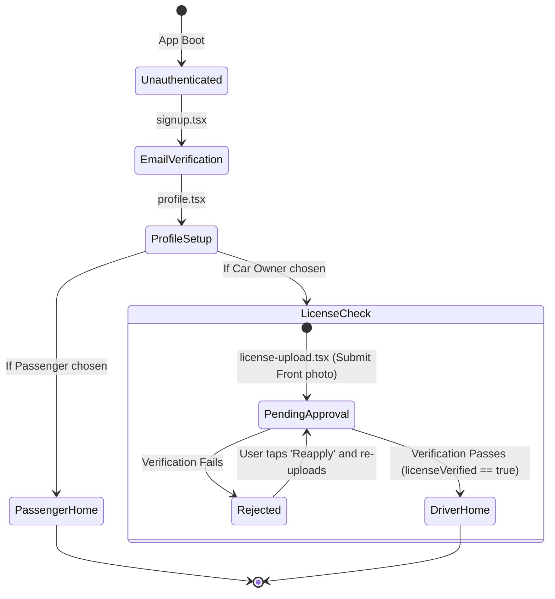

# PullUp - University-Exclusive Peer-to-Peer Carpooling
> Exclusively for Atlas SkillTech University Community
> A premium, highly interactive React Native Expo application built with TypeScript, StyleSheet/Tailwind, and Firebase Firestore, designed to match students together for daily commuting, saving fuel, and reducing carbon footprints.

---

## Table of Contents
1. [App Architecture and Key Design Paradigms](#app-architecture-and-key-design-paradigms)
2. [Root Authentication Guards and Session Routing](#root-authentication-guards-and-session-routing)
3. [Onboarding and Identity Screens (Auth)](#onboarding-and-identity-screens-auth)
4. [Passenger Journeys and Core Screens (Passenger)](#passenger-journeys-and-core-screens-passenger)
5. [Car Owner Hub and Administrative Screens (Car Owner)](#car-owner-hub-and-administrative-screens-car-owner)
6. [Shared System and Communication Overlays (Shared)](#shared-system-and-communication-overlays-shared)
7. [Utilities, Mathematical Savings Models, and Core Algorithms (Utilities)](#utilities-mathematical-savings-models-and-core-algorithms-utilities)
8. [Project Structure and Complete Module Directory Mapping](#project-structure-and-complete-module-directory-mapping)

---

## App Architecture and Key Design Paradigms

PullUp features a dark-mode user interface designed to match premium corporate ridesharing and financial platforms. Its styling system relies on unified stylesheet definitions (with hex palettes from #0A0A0A to #121212) paired with spring-physics transitions to provide tactile feedback during user interactions.

### Unified Micro-Animation Design Tokens
*   **Tactile Spring Physics:** Buttons, navigation targets, and list cards apply scale reductions on press (typically scaling to 0.95x or 0.98x) using a mass-spring-damper mathematical model (configured with a damping coefficient of 14, stiffness of 220, and mass of 0.7) for high responsiveness.
*   **Sinusoidal Breathing CTAs:** Major action triggers apply a continuous breathing animation (scaling smoothly between 1.0x and 1.02x over an 1800ms period using sine-based easing loops) to naturally guide the user's attention.
*   **Staggered Entrance Reveals:** Form inputs, header text strings, and layout cards fade in and slide upward on mount (interpolating translation-Y from 16px to 0 with staggered delays of 80ms to 90ms between contiguous elements).
*   **Skeleton Shimmer Indicators:** Horizontal scrolling feeds display animated translucent grey skeletons (shimmering linearly between 0.35 and 0.7 opacity every 1000ms) to provide a fluid visual experience during database fetches.

---

## Root Authentication Guards and Session Routing

The app enforces a centralized security state machine within `app/_layout.tsx` and `app/index.tsx`. The routing engine evaluates the user's current session parameters on every boot and tab switch:



---

## Onboarding and Identity Screens (Auth)

### 1. Root Security Routing Guard (app/index.tsx, app/_layout.tsx)
*   **Role Redirector Engine:** Instantly evaluates user profile flags (`isSignedIn`, `role`, `licenseVerificationStatus`, `profileComplete`). Redirects passengers to `/home` and drivers to `/driver-home`.
*   **License Checkpoint Gatekeeper:** If a driver's license status is pending or rejected, it locks the tabs layout and routes them to `app/auth/license-upload.tsx`.

### 2. Academic Domain Verification Screen (app/auth/signup.tsx)
*   **Domain Restriction Filter:** Requires users to register with a university email address. The input automatically appends or verifies the official `@atlasskilltech.university` domain suffix, blocking standard commercial email formats.
*   **SMTP OTP Dispatch Service:** Integrates with a server API client via `backendApiClient.ts` (`/api/otp/send-otp`) to dispatch a secure 4-digit code directly to the university inbox.
*   **Numeric Code Validator:** Features a numerical grid layout that handles auto-focus shifting (moving focus forward on numerical press and regressing on backspace), input pasting, and an active timer counting down to code expiry.

### 3. Student Profile Setup Screen (app/auth/profile.tsx)
*   **Personal and Academic Metadata Entry:** Captures university demographic markers:
    *   *Full Name:* Custom text input with character validations.
    *   *Phone Number:* String field restricted to 10 digits.
    *   *Academic Year:* Options for FY, SY, TY, and Final Year.
    *   *Degree/Course:* Form inputs supporting specific degree pathways (e.g., BBA, BDes, BTech CSE).
    *   *Division:* Custom selectors mapped to standard divisions (A, B, C, D, E, F).
*   **Profile Picture Cloudinary Uploader:** Lets users capture a picture using the device camera or select a photo from the gallery. Tapping upload sends the asset as a Base64 stream to Cloudinary under the `/user_avatars` directory, returning a secure HTTPS link to store in the user's Firestore document.
*   **Role Chooser Toggle:** A custom horizontal slide control to select the user's default role: Passenger or Car Owner.

### 4. License Verification Screen (app/auth/license-upload.tsx)
*   **Cropping Bounding Box:** Renders a 1.586:1 aspect-ratio template overlay (matching the format of a standard Indian driving license) to ensure text readability in the captured photo.
*   **Secure Document Cloudinary Bucket:** Uploads the verified document directly to Cloudinary under the `/driver_licenses` directory.
*   **Reactive Status Polling Engine:** Updates the user's document in Firestore with `licenseVerificationStatus: 'pending'`. The screen then starts a **5-second polling interval** that checks for admin approvals in Firestore.
*   **Admin Rejection Card:** Displays a red alert container with specific feedback from the administrator if verification fails. Tapping "Reapply" clears the rejected status and allows the user to re-upload their document.

---

## Passenger Journeys and Core Screens (Passenger)

### 1. Passenger Home Feed (app/(tabs)/home.tsx)
*   **Dynamic Time-Based Greeting:** Renders greetings (e.g., "Good Morning", "Good Evening") based on the device clock, paired with a pulsing notification bell for unread alerts.
*   **GPS Nearby Rides Carousel:** Requests device location permissions. Calculates the distance to available rides using a **Haversine formula** and displays active carpools within a 10 km radius, sorted from closest to furthest.
*   **Multi-Query Search Filters:** A live text search bar that filters the rides feed in real-time by pickup address, dropoff address, or driver name.
*   **Interactive Ride Detail Sheet:** Tapping any card opens a slide-up modal showing pickup/dropoff points, available seats, driver notes, price per seat, and an interactive mock "Book This Ride" sequence showing a circular loading spinner and success checkmark.

### 2. Active Rides List View (app/all-rides.tsx)
*   **All Rides Feed Scroll:** A scrollable list of all active rides in the system, sorted by distance from the passenger's current coordinates.
*   **Dynamic Metadata Indicators:** Displays driver initials, exact departure times, remaining seats, and computed trip distances inside a clean border layout.

### 3. Booking Proximity Confirmation Screen (app/booking-confirmation.tsx)
*   **Trip Fare Matrix:** Shows a detailed price breakdown (per-seat cost, seats selected, and final price).
*   **Mock Transaction Engine:** Shows a progress indicator while writing booking records to the database.
*   **Confirmation Timeline Details:** Renders a timeline with the pickup location, dropoff location, departure time, and driver details once the reservation is requested.

### 4. My Bookings Dashboard (app/(tabs)/my-bookings.tsx)
*   **Interactive Status Logs:** Lists upcoming, ongoing, and past passenger bookings, labeled with distinct color-coded badges:
    *   *Requested (Yellow):* Sent to the driver; awaiting confirmation.
    *   *Accepted (Green):* Booking confirmed.
    *   *Rejected (Red):* Request declined by the driver.
    *   *Cancelled (Grey):* Cancelled by the user.
*   **Proximity-Based Cancellation Model:** Enforces a cancellation policy based on departure proximity:
    *   *Departure > 20 Minutes:* Allows free cancellation with no penalty.
    *   *Departure <= 20 Minutes:* Displays a warning modal outlining a **50% cancellation fee** before confirming the cancellation.

### 5. Ride History Screen (app/(tabs)/ride-history.tsx)
*   **Historical Activity Log:** Lists past completed passenger trips, total expenditure, and passenger statistics.
*   **One-Tap Repeat Ride Rebooker:** Tapping "Repeat Ride" on a historical card instantly redirects the passenger to the booking page for that driver's next scheduled trip.

---

## Car Owner Hub and Administrative Screens (Car Owner)

### 1. Earnings Overview Dashboard (app/(tabs)/driver-home.tsx)
*   **Earnings Counters:** Displays weekly earnings, today's projected income, and simulated fuel savings in INR. Numeric values apply a count-up transition when the screen loads.
*   **Actionable CTAs:** Provides haptic button targets to launch the mileage calculator or post a new ride.
*   **Today's Ride Dashboard:** If a ride is scheduled today, it displays route timelines, booked seats ratios (e.g., "2/4 booked"), total active passengers, and a prominent "Start Ride" trigger.

### 2. Geofenced Ride Creator (app/(tabs)/post-ride.tsx)
*   **2 km Radius Geofence Auto-Lock:** Calls the location utility `isWithinAtlasRadius` to detect coordinates relative to Atlas SkillTech University. It automatically manages form inputs to prevent student errors:
    *   If driver is *inside* the Atlas geofence: Set the *Pickup Location* to Atlas, forcing the driver to input their Dropoff address.
    *   If driver is *outside* the Atlas geofence: Set the *Dropoff Location* to Atlas, forcing the driver to input their Pickup address.
*   **Academic Direction Enforcer:** If a route is configured without either pickup or dropoff at Atlas, the ride submission is blocked with a warning: *"Rides must be either from home to Atlas, or from Atlas to home/other location."*
*   **Pricing Suggestions:** Displays price per seat selectors with suggested travel rates (₹80–₹120) based on typical university travel costs.
*   **Success Screen Sonar:** Successfully posting a ride triggers a radial checkmark animation with concentric green sonar pulses that expand and fade recursively.

### 3. Posted Rides Manager (app/(tabs)/my-rides.tsx)
*   **Expandable Accordion Cards:** Displays all posted rides in an interactive list. Clicking cards triggers a smooth scale scale animation, opening an accordion list of booking requests.
*   **Passenger Management Portal:** Allows drivers to review passenger profiles, student divisions, and requested seats. They can tap *Accept* or *Reject* to instantly update Firestore and send push notifications.
*   **Danger Zone Alert:** Prompts drivers with warnings that cancelling active rides will trigger automated push notices to affected passengers.

### 4. Ongoing Ride Tracking Dashboard (app/(tabs)/driver-rides.tsx)
*   **Ride State Controller:** Manages the ride's lifecycle states: `active` -> `in_progress` -> `completed` or `cancelled`.
*   **Active Controls:** Once `in_progress`, the driver can open group chats, access real-time navigation maps, and tap "Finish Ride" to log final savings.

---

## Shared System and Communication Overlays (Shared)

### 1. Proximity Messaging Screen (app/chat.tsx)
*   **Chat Proximity Restriction:** Restricts chat access. The messaging panel and input fields are only unlocked when the ride's status is `in_progress` or `completed`. A restricted banner shows when the ride has not started or has been cancelled.
*   **Secure Phone Dialing Modal:** Driver and passenger phone numbers are locked in the database and only become accessible via a dialer overlay once the ride has started.
*   **Real-time Firestore Message Subscriptions:** Streams message threads in real-time, marks messages as read, and includes system-generated activity notices (e.g., booking acceptances, ride completions).

### 2. Status Notifications Drawer (app/notifications.tsx)
*   **Notification Feed:** Displays updates with customized badges based on the notification type:
    *   *Booking Request:* Blue badge; sent to drivers when a passenger requests a seat.
    *   *Booking Accepted:* Green badge; sent to passengers when accepted.
    *   *Booking Rejected:* Red badge; sent to passengers when rejected.
    *   *Ride Started:* Purple badge; alerts passengers when the driver begins the trip.
    *   *Ride Completed:* Cyan badge; confirms arrival and logs savings.
    *   *Ride Cancelled:* Orange badge; alerts passengers of cancellations.
    *   *Message:* Pink badge; alerts users of incoming chat messages.
*   **Clean Read Notifications Action:** Allows users to mark all notifications as read or delete read logs using a dynamic confirmation modal.

### 3. Interactive Ride Detail Screen (app/ride-details.tsx)
*   **Dark-Theme Route Timeline:** Displays trip pickup and dropoff points, available seats, driver notes, price per seat, and an interactive mock "Book This Ride" sequence showing a circular loading spinner and success checkmark.
*   **Google Maps Integration:** Integrates MapView using a custom dark theme. Renders the calculated trip coordinates with a dual-layer Polyline (a thick black border offset by a solid white inner line) for clean contrast.

### 4. Editable Student Profile Screen (app/profile-edit.tsx)
*   **Input Fields with Validations:** Standard text inputs for Full Name, Phone Number, Course, and Division, with real-time character limit counters (e.g., 50-character limit for course name).
*   **Image Sourcing Alert Sheet:** Opens a native options alert sheet (Camera, Gallery, Remove) to update profile photos. Tapping Camera triggers the camera capture flow, and tapping Gallery opens the image selection panel.

---

## Utilities, Mathematical Savings Models, and Core Algorithms (Utilities)

### 1. Haversine Great-Circle Distance Algorithm
Calculates trip proximity and coordinate offsets inside `utils/locationUtils.ts`:

```typescript
export function calculateDistance(lat1: number, lon1: number, lat2: number, lon2: number): number {
  const R = 6371; // Earth's radius in kilometers
  const dLat = (lat2 - lat1) * (Math.PI / 180);
  const dLon = (lon2 - lon1) * (Math.PI / 180);
  const a =
    Math.sin(dLat / 2) * Math.sin(dLat / 2) +
    Math.cos(lat1 * (Math.PI / 180)) *
      Math.cos(lat2 * (Math.PI / 180)) *
      Math.sin(dLon / 2) *
      Math.sin(dLon / 2);
  const c = 2 * Math.atan2(Math.sqrt(a), Math.sqrt(1 - a));
  return R * c;
}
```

### 2. Google Places Autocomplete API (New) Integration
Retrieves matching addresses and locations inside `utils/locationUtils.ts`:
*   *Search Bias Center:* Centers autocomplete results on the Mumbai metropolitan area (`latitude: 19.0760`, `longitude: 72.8777`) with a 50 km circle limit.
*   *Restricted Domain:* Filters results to India (`includedRegionCodes: ["in"]`).
*   *Field Masking:* Uses POST queries specifying the header `X-Goog-FieldMask: suggestions.placePrediction.placeId` to limit billing costs.

### 3. Fuel Offset and CO₂ Savings Mathematical Model
Estimates savings inside `utils/carOwnerCalculatorService.ts` and `components/CarOwnerCalculator.tsx`:

$$\text{Daily Solo Cost} = \left(\frac{\text{One-Way Distance} \times 2}{\text{Mileage}}\right) \times \text{Fuel Price}$$

$$\text{Daily Carpool Cost} = \frac{\text{Daily Solo Cost}}{\text{Passengers Count}}$$

$$\text{Monthly Savings} = \left(\text{Daily Solo Cost} - \text{Daily Carpool Cost}\right) \times \text{Days per Month}$$

$$\text{Yearly Savings} = \text{Monthly Savings} \times \text{Months per Year}$$

$$\text{Yearly }\text{CO}_2\text{ Saved (kg)} = \left(\text{Daily Solo Liters} \times (\text{Passengers} - 1)\right) \times 2.31 \times \text{Days per Month} \times \text{Months per Year}$$

$$\text{Tree Planting Equivalent} = \frac{\text{Yearly }\text{CO}_2\text{ Saved in Tons}}{1000} \times 16.67\text{ trees}$$

---

## Project Structure and Complete Module Directory Mapping

```
📂 PullUp/
├── 📂 app/                     # Central navigation router directory
│   ├── 📂 (tabs)/              # Primary navigation tab components
│   │   ├── 📄 home.tsx         # Passenger Home screen, search, and nearby rides feed
│   │   ├── 📄 driver-home.tsx  # Driver Home dashboard, earnings overview, and savings metrics
│   │   ├── 📄 post-ride.tsx    # Geofenced ride publisher with direction validators
│   │   ├── 📄 my-bookings.tsx  # Passenger bookings list showing trip statuses and cancellations
│   │   └── 📄 my-rides.tsx     # Driver posted rides list with expandable passenger requests
│   ├── 📂 auth/                # Sign-in and onboarding directories
│   │   ├── 📄 signup.tsx       # Email domain validator screen with SMTP OTP triggers
│   │   ├── 📄 profile.tsx      # Academic profile onboarding screen
│   │   └── 📄 license-upload.tsx# Cropped driving license upload screen with 5s poller
│   ├── 📄 chat.tsx             # Real-time passenger-driver message thread panel
│   ├── 📄 notifications.tsx    # Notifications feed showing unread badges and filters
│   ├── 📄 profile-edit.tsx     # Edit profile screen with input validators and camera alerts
│   ├── 📄 ride-details.tsx     # Google Map route screen with bottom-sheet gesture controls
│   └── 📄 booking-confirmation.tsx# Fare details screen with transaction progress indicators
├── 📂 components/              # Shared UI components
│   ├── 📄 CarOwnerCalculator.tsx# Fuel cost, mileage, and carbon footprint calculator
│   └── 📄 LocationSearchInput.tsx# Autocomplete input selector centered on the Mumbai geofence
└── 📂 utils/                   # Shared utility service modules
    ├── 📄 atlasLocationUtils.ts# University geofencing rules and boundary coordinates
    ├── 📄 locationUtils.ts     # Haversine distance equations and Google Maps API client
    └── 📄 carOwnerCalculatorService.ts# Mathematical equations for simulated travel savings
```
